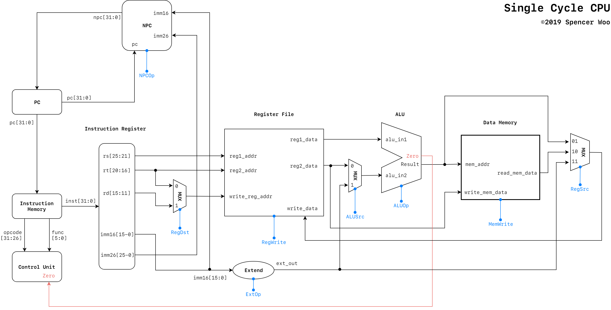
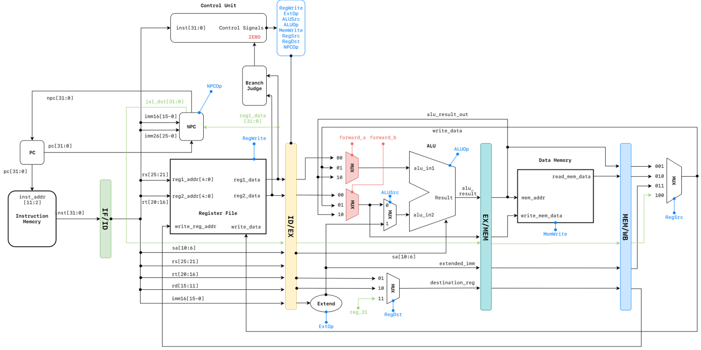
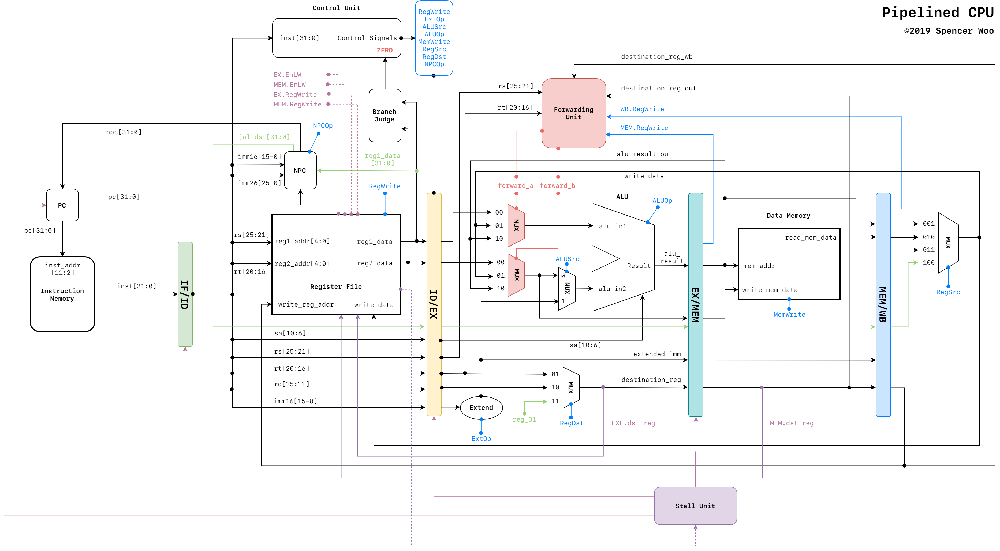

# 📃 Diagrams

Data Path for ZanPU.

Complete data path diagrams with support for single cycle CPU, pipelined CPU and pipelined CPU with hazard control. Usable.

## Single Cycle

## Pipeline - basic

## Pipeline - with forwarding and stalling units

---

**📃 Diagrams** ©2019 ZanPU. Released under the [MIT License](./LICENSE).

Authored and maintained by Team ZanPU.

Created with love ♥ from BIT, Beijing.

[@BIT](https://www.bit.edu.cn) · [@GitHub](https://github.com/zan-pu) · [Documentation](https://zanpu.spencerwoo.com)
